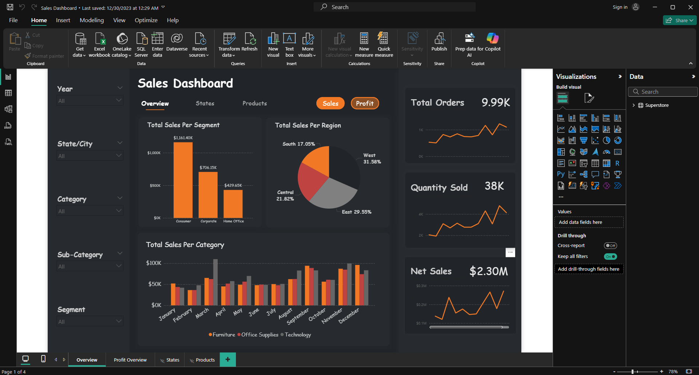
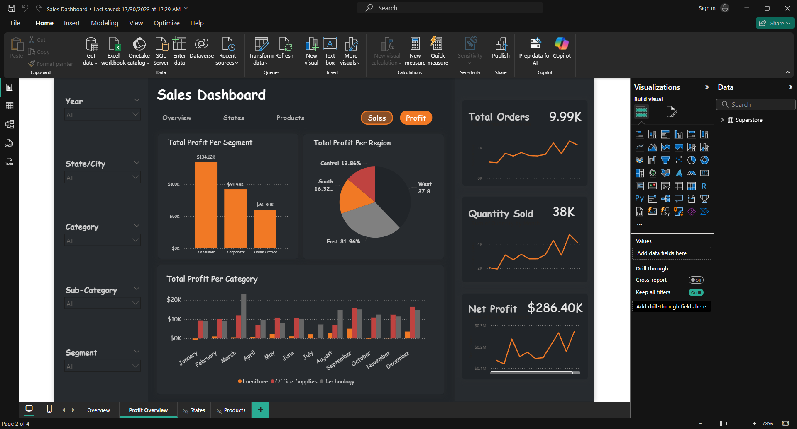
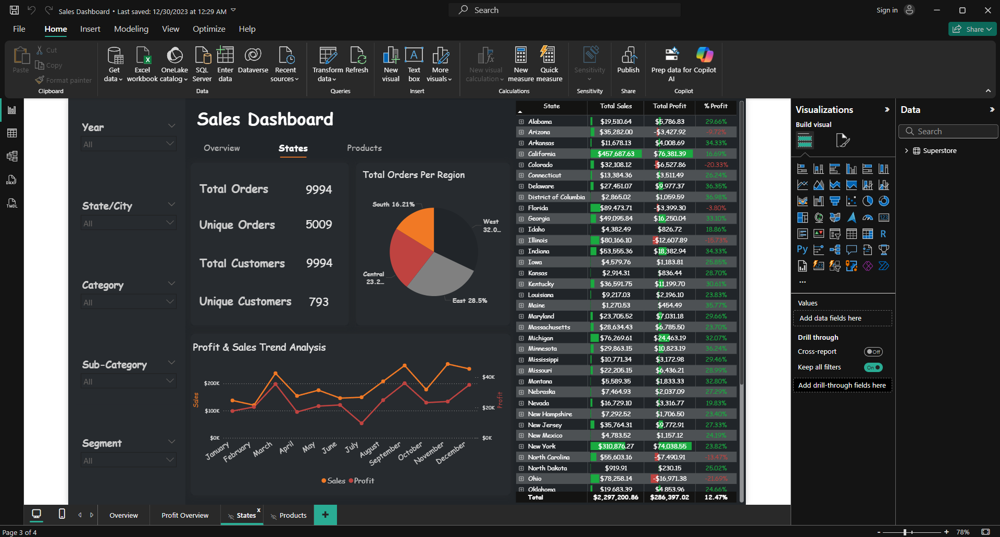
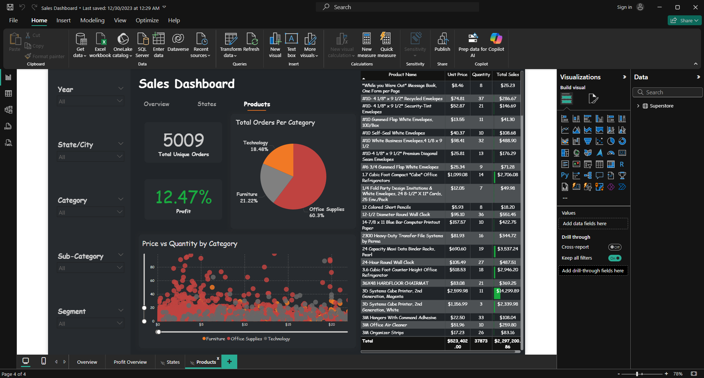

# Sales Dashboard

This Power BI project analyzes sales and profit performance across regions, products, and customer segments.  
The dashboard provides insights into total sales, profitability, and product-level performance.

---

## Dashboard Highlights
- **Sales Overview** → Sales by segment, region, total orders, and quantity sold.  
- **Profit Analysis** → Profit by segment, region, and overall profitability trends.  
- **Regional Insights** → Sales vs. profit over time, orders by region, and profit contribution by state.  
- **Product Performance** → Product-level sales, pricing, orders, and category analysis.  

---

## Files in Repository
- Sales Report.pbix → Power BI report file.  
- Superstore.xlsx → Source dataset used.  
- screenshots/ → Example dashboard visuals.  

---

## Screenshots  
### Sales Overview  
  

### Profit Overview  
  

### Regional Insights  
  

### Product Analysis  
  

---

## How to Use
1. Download the `.pbix` file.  
2. Open it in **Power BI Desktop**.  
3. Explore the visuals interactively.  

---

## Skills Demonstrated
- Data cleaning and modeling  
- DAX measures and calculated columns  
- Interactive dashboard design  
- Data storytelling & sales performance analysis  
